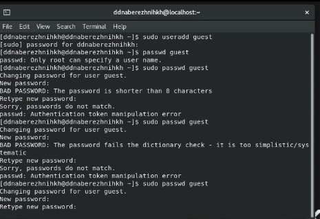
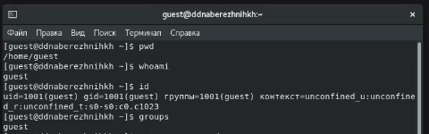
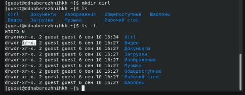
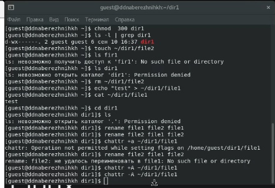

---
## Front matter
lang: ru-RU
title: Лабораторная работа №2
subtitle: Основы информационной безопасности
author:
  - Набережных Дарина Денисовна, НПМбд-01-19
institute:
  - Российский университет дружбы народов, Москва, Россия
date: 17 сентября 2022 года

## i18n babel
babel-lang: russian
babel-otherlangs: english

## Formatting pdf
toc: false
toc-title: Содержание
slide_level: 2
aspectratio: 169
section-titles: true
theme: metropolis
header-includes:
 - \metroset{progressbar=frametitle,sectionpage=progressbar,numbering=fraction}
 - '\makeatletter'
 - '\beamer@ignorenonframefalse'
 - '\makeatother'
---

# Разграничение прав и основные атрибуты.

## Цель работы 

- Приобрести навыки работы с атрибутами файлов через консоль.
- Увидеть влияние атрибутов на различные действия 

## Задачи лабораторной работы

- Создать нового пользователя
- Изучить команды для работы с атрибутами и изучить влияние атрибутов на конкретном файле 

# Ход выполнения лабораторной работы 

## Создание нового пользователя

Создаем нового пользователя и устанавливаем для него пароль

 

## Проверка данных нового пользователя

Зайдем в систему от имени нового только что созданного пользователя и узнаем его uid и группы, в которых он состоит

 

## Просмотр атрибутов

Осуществим просмотр атрибутов, а так же посмотрим расширенные атрибуты

 

## Просмотр установленных прав

Сменим основные атрибуты и посмотрим таблицу с действиями, которые можно и нельзя совершать 

 

## Выводы

- Я научилась работать с атрибутами файлов и директорий
- Я изучила и выяснила минимальные права доступа для совершения тех или иных действий

