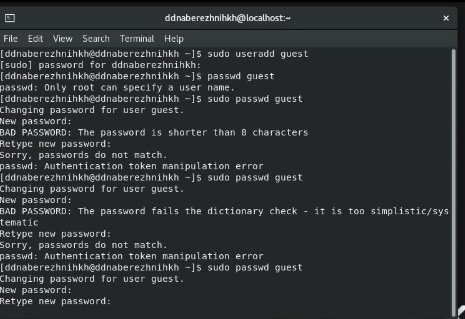
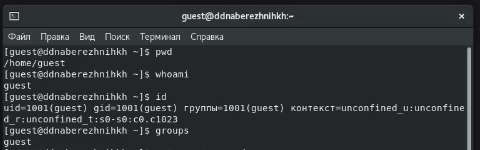
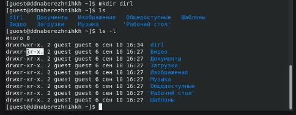
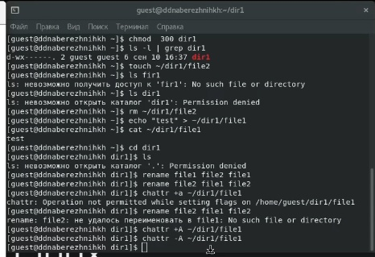

---
## Front matter
title: "Отчёт по лабораторной работе №2"
subtitle: "Дисциплина: Основы информационной безопасности"
author: "Набережных Дарина Денисовна, НПМбд-01-19"

## Generic otions
lang: ru-RU
toc-title: "Содержание"

## Bibliography
bibliography: bib/cite.bib
csl: pandoc/csl/gost-r-7-0-5-2008-numeric.csl

## Pdf output format
toc: true # Table of contents
toc-depth: 2
lof: true # List of figures
lot: true # List of tables
fontsize: 12pt
linestretch: 1.5
papersize: a4
documentclass: scrreprt
## I18n polyglossia
polyglossia-lang:
  name: russian
  options:
	- spelling=modern
	- babelshorthands=true
polyglossia-otherlangs:
  name: english
## I18n babel
babel-lang: russian
babel-otherlangs: english
## Fonts
mainfont: PT Serif
romanfont: PT Serif
sansfont: PT Sans
monofont: PT Mono
mainfontoptions: Ligatures=TeX
romanfontoptions: Ligatures=TeX
sansfontoptions: Ligatures=TeX,Scale=MatchLowercase
monofontoptions: Scale=MatchLowercase,Scale=0.9
## Biblatex
biblatex: true
biblio-style: "gost-numeric"
biblatexoptions:
  - parentracker=true
  - backend=biber
  - hyperref=auto
  - language=auto
  - autolang=other*
  - citestyle=gost-numeric
## Pandoc-crossref LaTeX customization
figureTitle: "Рис."
tableTitle: "Таблица"
listingTitle: "Листинг"
lofTitle: "Список иллюстраций"
lotTitle: "Список таблиц"
lolTitle: "Листинги"
## Misc options
indent: true
header-includes:
  - \usepackage{indentfirst}
  - \usepackage{float} # keep figures where there are in the text
  - \floatplacement{figure}{H} # keep figures where there are in the text
---

# Цель работы

Получить навыки работы в консоли с правами и атрибутами файлов и директорий, а
также проверка необходимых прав для выполнения различных действий для работы с файлами
и диреториями.

# Теоретическое введение

Атрибуты --- это набор основных девяти битов, определяющих какие из пользователей обладают правами на чтение, запись
и исполнение. 

# Выполнение лабораторной работы

Создаём нового пользователя guest командой useradd, затем устанавливаем для него пароль с помощью команды passwd guest (рис. [-@fig:001]).

{ #fig:001 width=70% }

Заходим в систему от имени пользователя guest. Выполняем команду, которая показывает, что мы находимся в домашнем каталоге пользователя guest. Уточняем имя пользователя командой whoami. C помощью команды id узнаём, что uid = 1001, gid = 1001 (guest). При вводе команды groups видим, что группа состоит из одного пользователя guest (рис. [-@fig:002]).

{ #fig:002 width=70% }

Находим информацию о пользователе, что соответствует данным, полученным с помощью команды id и pwd. Далее
определяем содержимое каталога /home. (рис. [-@fig:003]).

{ #fig:003 width=70% }

Меняем атрибуты с помощью команды chmod. Изучим, как влияют различные комбинации атрибутов файлов и директории на различные действия. Создаем файл командой touch, удалим его командой rm, запишем в файл командой echo >, прочитаем командой cat, сменим директорию командой cd, просмотрим директорию командой ls, переименуем файл командой rename и сменим атрибуты командой chattr (рис. [-@fig:004]).

{ #fig:005 width=70% }

В случае успеха будет записывать +, в случае ошибки доступа будем записывать -. Соберём данные в таблицу [-@tbl:std-dir].

: Установленные права и разрешённые действия {#tbl:std-dir}

| Права директории | Права файла | Создание файла | Удаление файла | Запись в файл | Чтение файла | Смена директории | Просмотр файлов в директории | Переименование файла | Смена атрибутов файла |
| ---------------- | ----------- | -------------- | -------------- | ------------- | ------------ | ---------------- | ------------------- | ----------- | ---------- |
| d (000) | (000) | - | - | - | - | - | - | - | - |
| d --x (100) | (000) | - | - | - | - | + | - | - | - |
| d -w- (200) | (000) | - | - | - | - | - | - | - | - |
| d -wx (300) | (000) | + | + | - | - | + | - | + | - |
| d r-- (400) | (000) | - | - | - | - | - | + | - | - |
| d r-x (500) | (000) | - | - | - | - | + | + | - | - |
| d rw- (600) | (000) | - | - | - | - | - | + | - | - |
| d rwx (700) | (000) | + | + | - | - | + | + | + | - |
| d (000) | --x (100) | - | - | - | - | - | - | - | - |
| d --x (100) | --x (100) | - | - | - | - | + | - | - | - |
| d -w- (200) | --x (100) | - | - | - | - | - | - | - | - |
| d -wx (300) | --x (100) | + | + | - | - | + | - | + | - |
| d r-- (400) | --x (100) | - | - | - | - | - | + | - | - |
| d r-x (500) | --x (100) | - | - | - | - | + | + | - | - |
| d rw- (600) | --x (100) | - | - | - | - | - | + | - | - |
| d rwx (700) | --x (100) | + | + | - | - | + | + | + | - |
| d (000) | -w- (200) | - | - | - | - | - | - | - | - |
| d --x (100) | -w- (200) | - | - | + | - | + | - | - | - |
| d -w- (200) | -w- (200) | - | - | - | - | - | - | - | - |
| d -wx (300) | -w- (200) | + | + | + | - | + | - | + | - |
| d r-- (400) | -w- (200) | - | - | - | - | - | + | - | - |
| d r-x (500) | -w- (200) | - | - | + | - | + | + | - | - |
| d rw- (600) | -w- (200) | - | - | - | - | - | + | - | - |
| d rwx (700) | -w- (200) | + | + | + | - | + | + | + | - |
| d (000) | -wx (300) | - | - | - | - | - | - | - | - |
| d --x (100) | -wx (300) | - | - | + | - | + | - | - | - |
| d -w- (200) | -wx (300) | - | - | - | - | - | - | - | - |
| d -wx (300) | -wx (300) | + | + | + | - | + | - | + | - |
| d r-- (400) | -wx (300) | - | - | - | - | - | + | - | - |
| d r-x (500) | -wx (300) | - | - | + | - | + | + | - | - |
| d rw- (600) | -wx (300) | - | - | - | - | - | + | - | - |
| d rwx (700) | -wx (300) | + | + | + | - | + | + | + | - |
| d (000) | r-- (400) | - | - | - | - | - | - | - | - |
| d --x (100) | r-- (400) | - | - | - | + | + | - | - | + |
| d -w- (200) | r-- (400) | - | - | - | - | - | - | - | - |
| d -wx (300) | r-- (400) | + | + | - | + | + | - | + | + |
| d r-- (400) | r-- (400) | - | - | - | - | - | + | - | - |
| d r-x (500) | r-- (400) | - | - | - | + | + | + | - | + |
| d rw- (600) | r-- (400) | - | - | - | - | - | + | - | - |
| d rwx (700) | r-- (400) | + | + | - | + | + | + | + | + |
| d (000) | r-x (500) | - | - | - | - | - | - | - | - |
| d --x (100) | r-x (500) | - | - | - | + | + | - | - | + |
| d -w- (200) | r-x (500) | - | - | - | - | - | - | - | - |
| d -wx (300) | r-x (500) | + | + | - | + | + | - | + | + |
| d r-- (400) | r-x (500) | - | - | - | - | - | + | - | - |
| d r-x (500) | r-x (500) | - | - | - | + | + | + | - | + |
| d rw- (600) | r-x (500) | - | - | - | - | - | + | - | - |
| d rwx (700) | r-x (500) | + | + | - | + | + | + | + | + |
| d (000) | rw- (600) | - | - | - | - | - | - | - | - |
| d --x (100) | rw- (600) | - | - | + | + | + | - | - | + |
| d -w- (200) | rw- (600) | - | - | - | - | - | - | - | - |
| d -wx (300) | rw- (600) | + | + | + | + | + | - | + | + |
| d r-- (400) | rw- (600) | - | - | - | - | - | + | - | - |
| d r-x (500) | rw- (600) | - | - | + | + | + | + | - | + |
| d rw- (600) | rw- (600) | - | - | - | - | - | + | - | - |
| d rwx (700) | rw- (600) | + | + | + | + | + | + | + | + |
| d (000) | rwx (700) | - | - | - | - | - | - | - | - |
| d --x (100) | rwx (700) | - | - | + | + | + | - | - | + |
| d -w- (200) | rwx (700) | - | - | - | - | - | - | - | - |
| d -wx (300) | rwx (700) | + | + | + | + | + | - | + | + |
| d r-- (400) | rwx (700) | - | - | - | - | - | + | - | - |
| d r-x (500) | rwx (700) | - | - | + | + | + | + | - | + |
| d rw- (600) | rwx (700) | - | - | - | - | - | + | - | - |
| d rwx (700) | rwx (700) | + | + | + | + | + | + | + | + |
 
Воспользуемся этой таблицей и занесем информацию о минимальных требованиях на права в новую таблицу [-@tbl:std-dir]

: Минимальные права для операций {-@tbl:std-dir}

| Операция | Минимальные права на директорию | Минимальные права на файл |
| -------- | ------------------------------- | ------------------------- |
| Создание файла | d -wx (300) | --- (000) |
| Удаление файла | d -wx (300) | --- (000) |
| Чтение файла | d --x (100) | r-- (400) |
| Запись в файл | d --x (100) | -w- (200) |
| Переименование файла | d -wx (300) | --- (000) |
| Создание поддиректории | d -wx (300) | --- (000) |
| Удаление поддиректории | d -wx (300) | --- (000) |

# Выводы

Я научилась работать с атрибутами директорий и файлов через консоль, а так же составила список минимальных требований и прав для различных действий.

# Список литературы{.unnumbered}

::: {#refs}
:::
