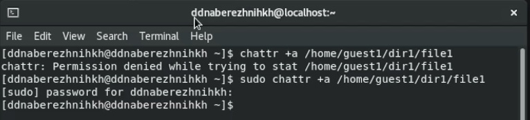
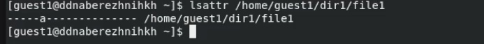
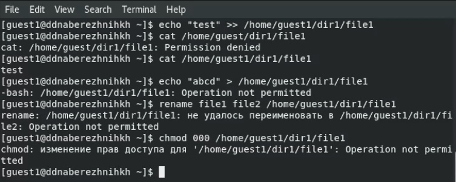
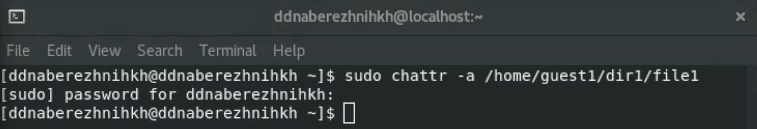
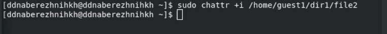
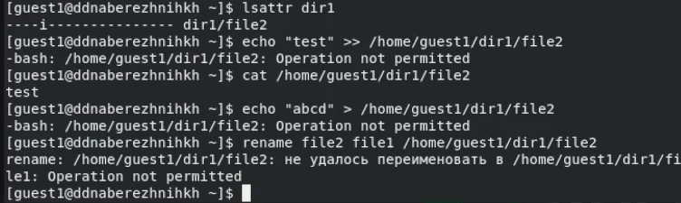

---
## Front matter
title: "Отчёт по лабораторной работе №4"
subtitle: "Дисциплина: Основы информационной безопасности"
author: "Набережных Дарина Денисовна, НПМбд-01-19"

## Generic otions
lang: ru-RU
toc-title: "Содержание"

## Bibliography
bibliography: bib/cite.bib
csl: pandoc/csl/gost-r-7-0-5-2008-numeric.csl

## Pdf output format
toc: true # Table of contents
toc-depth: 2
lof: true # List of figures
lot: true # List of tables
fontsize: 12pt
linestretch: 1.5
papersize: a4
documentclass: scrreprt
## I18n polyglossia
polyglossia-lang:
  name: russian
  options:
	- spelling=modern
	- babelshorthands=true
polyglossia-otherlangs:
  name: english
## I18n babel
babel-lang: russian
babel-otherlangs: english
## Fonts
mainfont: PT Serif
romanfont: PT Serif
sansfont: PT Sans
monofont: PT Mono
mainfontoptions: Ligatures=TeX
romanfontoptions: Ligatures=TeX
sansfontoptions: Ligatures=TeX,Scale=MatchLowercase
monofontoptions: Scale=MatchLowercase,Scale=0.9
## Biblatex
biblatex: true
biblio-style: "gost-numeric"
biblatexoptions:
  - parentracker=true
  - backend=biber
  - hyperref=auto
  - language=auto
  - autolang=other*
  - citestyle=gost-numeric
## Pandoc-crossref LaTeX customization
figureTitle: "Рис."
tableTitle: "Таблица"
listingTitle: "Листинг"
lofTitle: "Список иллюстраций"
lolTitle: "Листинги"
## Misc options
indent: true
header-includes:
  - \usepackage{indentfirst}
  - \usepackage{float} # keep figures where there are in the text
  - \floatplacement{figure}{H} # keep figures where there are in the text
---

# Цель работы

Получить навыки работы с рашистренными атрибутами файлов в консоли.

# Теоретическое введение

Атрибуты --- это набор основных девяти битов, определяющих какие из пользователей обладают правами на чтение, запись
и исполнение. Расширенные атрибуты --- это система доп.информации, которую можно добавить к файлу или директории, например: -а --- файл можно открыть только в режиме добавления, - А --- при доступе к файлу его запись не изменяется, -i --- файл нельзя изменить

# Выполнение лабораторной работы

Посмотрим расширенные атрибуты файла и изменим права на этот файл, делая его доступным только для записи и чтения (рис. [-@fig:001]).

{ #fig:001 width=70% }

От имени администратора в другой консоли добавим атрибут а (рис. [-@fig:002]).

{ #fig:002 width=70% }

Проверим корректность добавления атрибута а (рис. [-@fig:003]).

{ #fig:003 width=70% }

Дозапишем новую информацию в конец файла и проверим, что она действительно добавилась. Потом попробуем стереть информацию в файле, но получим ошибку. Так же мы не можем перименовать файл и изменить его атрибуты  (рис. [-@fig:004]).

{ #fig:004 width=70% }

Снимем атрибут а от имени администратора и повторим прошлые действия (рис. [-@fig:005]).

{ #fig:005 width=70% }

Добавим атрибут i от имени администратора (рис. [-@fig:006]).

{ #fig:006 width=70% }

Теперь повторим прошлые действия (рис. [-@fig:007]).

{ #fig:007 width=70% }
 
# Выводы

Я научилась работать с расширенными атрибутами файлов через консоль и приобрела практические навыки действий над файлами с расширенными атрибутами

# Список литературы{.unnumbered}

::: {#refs}
:::
