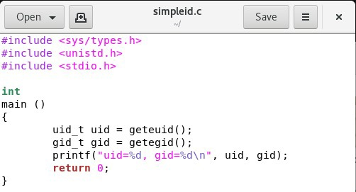

---
## Front matter
lang: ru-RU
title: Лабораторная работа №5
subtitle: Основы информационной безопасности
author:
  - Набережных Дарина Денисовна, НПМбд-01-19
institute:
  - Российский университет дружбы народов, Москва, Россия
date: 4 октября 2022 года

## i18n babel
babel-lang: russian
babel-otherlangs: english

## Formatting pdf
toc: false
toc-title: Содержание
slide_level: 2
aspectratio: 169
section-titles: true
theme: metropolis
header-includes:
 - \metroset{progressbar=frametitle,sectionpage=progressbar,numbering=fraction}
 - '\makeatletter'
 - '\beamer@ignorenonframefalse'
 - '\makeatother'
---

# Дискреционное разграничение прав. Изучение дополнительных атрибутов

## Цель работы 

- Изучить механизмы изменения индентификатора.
- Изучить особенности работы с дополнительными атрибутами

## Задачи лабораторной работы

- Создать программу, выводящую SetUID, SetGID, Sticky
- Создать программу для чтения файлов и проверить ее вывод 

# Ход выполнения лабораторной работы 

## Создание файла simpleid

Создадим файл simpleid и запишем в него программу:

 

## Компиляция программы

Скомпилируем программу и посмотрим ее вывод:

 

## Создание файла simpleid2

Создадим файл simpleid2 на основе simpleid и запишем в него следующую программу:

 

## Компиляция программы simpleid2

Скомпилируем программу simpleid2

 

## Запуск программы

Посмотрим, что выводит программа simpleid2

 

## Установка SetUID-бита 

Установим бит

 

## Запуск программы

Посмотрим, что выводит программа simpleid2

 

## Установка SetGID-бита 

Установим бит

 

## Создание программы

Создадим программу и запишем в нее следующий текст:

 

## Компиляция программы readfile

Скомпилируем программу readfile

 

## Выводы

- Узнала механизмы изменения идентификатора

