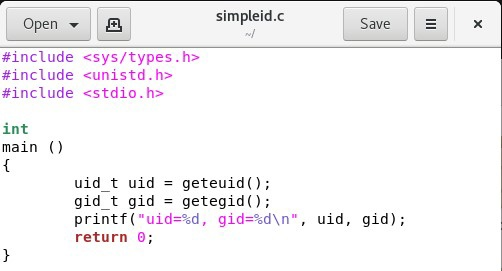
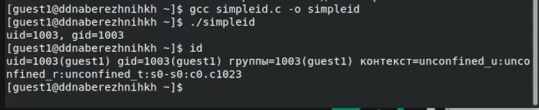
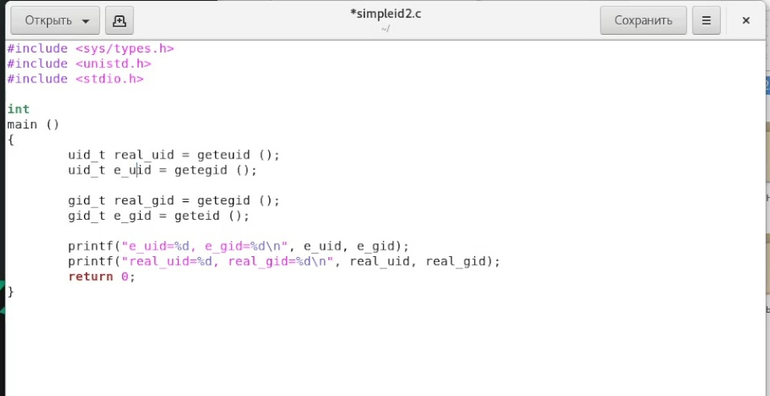
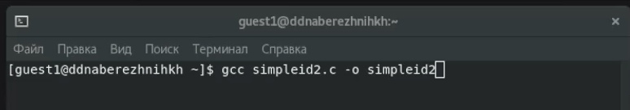
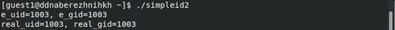
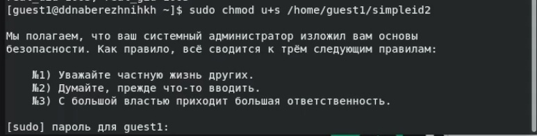
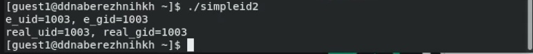
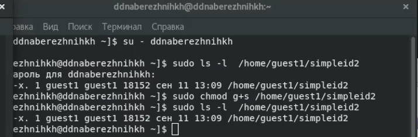
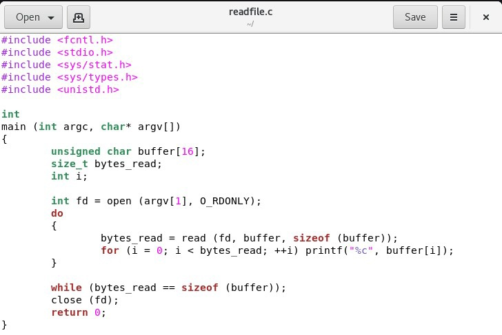
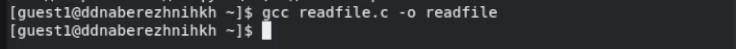

---
## Front matter
title: "Отчёт по лабораторной работе №5"
subtitle: "Дисциплина: Основы информационной безопасности"
author: "Набережных Дарина Денисовна, НПМбд-01-19"

## Generic otions
lang: ru-RU
toc-title: "Содержание"

## Bibliography
bibliography: bib/cite.bib
csl: pandoc/csl/gost-r-7-0-5-2008-numeric.csl

## Pdf output format
toc: true # Table of contents
toc-depth: 2
lof: true # List of figures
lot: true # List of tables
fontsize: 12pt
linestretch: 1.5
papersize: a4
documentclass: scrreprt
## I18n polyglossia
polyglossia-lang:
  name: russian
  options:
	- spelling=modern
	- babelshorthands=true
polyglossia-otherlangs:
  name: english
## I18n babel
babel-lang: russian
babel-otherlangs: english
## Fonts
mainfont: PT Serif
romanfont: PT Serif
sansfont: PT Sans
monofont: PT Mono
mainfontoptions: Ligatures=TeX
romanfontoptions: Ligatures=TeX
sansfontoptions: Ligatures=TeX,Scale=MatchLowercase
monofontoptions: Scale=MatchLowercase,Scale=0.9
## Biblatex
biblatex: true
biblio-style: "gost-numeric"
biblatexoptions:
  - parentracker=true
  - backend=biber
  - hyperref=auto
  - language=auto
  - autolang=other*
  - citestyle=gost-numeric
## Pandoc-crossref LaTeX customization
figureTitle: "Рис."
tableTitle: "Таблица"
listingTitle: "Листинг"
lofTitle: "Список иллюстраций"
lolTitle: "Листинги"
## Misc options
indent: true
header-includes:
  - \usepackage{indentfirst}
  - \usepackage{float} # keep figures where there are in the text
  - \floatplacement{figure}{H} # keep figures where there are in the text
---

# Цель работы

Изучение особенностей работы с дополнительными атрибутами и битами, а так же изучить их влияние на работу с файлами.

# Теоретическое введение

StUID, SetGID, Sticku - это специальные типы разрешений, которые позволяют задавать расширенные права доступа на файлы и каталоги. 

# Выполнение лабораторной работы

Создадим файл simpleid и запишем в него следующую программу: (рис. [-@fig:001]).

{ #fig:001 width=70% }

Скомпилируем simpleid.с и запустим его через ./ (рис. [-@fig:002]).

{ #fig:002 width=70% }

Теперь создадим программу simpleid2 на основе simpleid, изменив часть текста и добавив новые строки (рис. [-@fig:003]).

{ #fig:003 width=70% }

Скомпилируем программу simpleid2.с  (рис. [-@fig:004]).

{ #fig:004 width=70% }

Теперь запустим программу simpleid2.с через ./ (рис. [-@fig:005]).

{ #fig:005 width=70% }

Теперь установим SetGID-бит (рис. [-@fig:006]).

{ #fig:006 width=70% }

Запускаем программу simpleid2 заново(рис. [-@fig:007]).

{ #fig:007 width=70% }

Выполним команду ls-l и получим следующие результаты: [-@fig:008]).

{ #fig:008 width=70% }

Создадим readfile (рис. [-@fig:009]).

{ #fig:009 width=70% }

Скомпилируем файл readfile (рис. [-@fig:010]).

{ #fig:010 width=70% }
 
# Выводы

Я изучила механизм изменения идентификаторов и получила практические навыки по работе с битами

# Список литературы{.unnumbered}

::: {#refs}
:::
