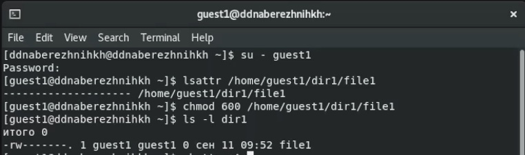
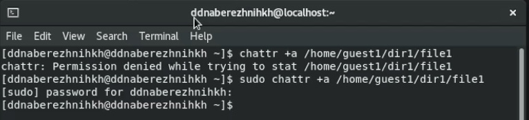
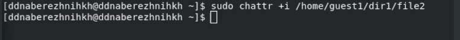
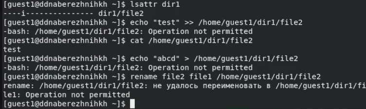

---
## Front matter
lang: ru-RU
title: Лабораторная работа №6
subtitle: Основы информационной безопасности
author:
  - Набережных Дарина Денисовна, НПМбд-01-19
institute:
  - Российский университет дружбы народов, Москва, Россия
date: 24 сентября 2022 года

## i18n babel
babel-lang: russian
babel-otherlangs: english

## Formatting pdf
toc: false
toc-title: Содержание
slide_level: 2
aspectratio: 169
section-titles: true
theme: metropolis
header-includes:
 - \metroset{progressbar=frametitle,sectionpage=progressbar,numbering=fraction}
 - '\makeatletter'
 - '\beamer@ignorenonframefalse'
 - '\makeatother'
---

# Разграничение прав и расширенные атрибуты.

## Цель работы 

- Приобрести навыки работы с расширенными атрибутами файлов через консоль.

## Задачи лабораторной работы

- Просмотреть расширенные атрибуты файлов
- Проверить совершение действий над файлом 
- Изменить расширенные атрибуты файлов через администратора
 

# Ход выполнения лабораторной работы 

## Создание нового пользователя

От имени пользователя просмотрим расширенные атрибуты файла

 

## Изменение расширенных атрибутов

От имени администратора добавим расширенный атрибут а

 

## Проверка расширенных атрибутов

Проверим, что расширенный атрибут а добавился корректно

 

## Проверка действий с файлом при наличии атрибута а

- Допишем информацию в файл и проверим, выполнилась ли команда
- Попробуем удалить информацию из файла, переименовать его и сменить атрибуты. Получим ошибки

 

## Удаление расширенного атрибута а

От имени администратора удалим расширенный атрибут а

 

## Установление расширенного атрибута i

От имени администратора добавим расширенный атрибут i 

 

## Проверка действий при наличии расширенного атрибута i

- Допишем информацию в файл и проверим, выполнилась ли команда
- Попробуем удалить информацию из файла, переименовать его и сменить атрибуты. Получим ошибки

 

## Выводы

- Я научилась работать с расширенными атрибутами 
- Изучила как влияют расширенные атрибуты на действия с файлами.

