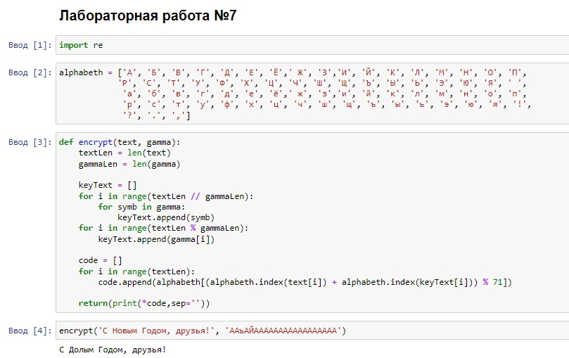
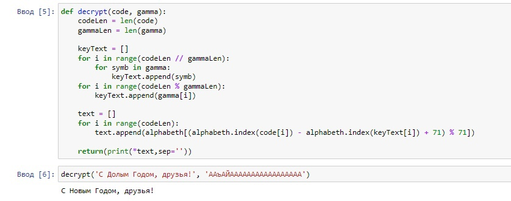
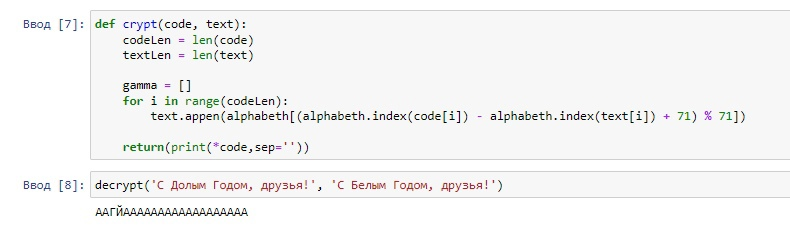

---
## Front matter
lang: ru-RU
title: Лабораторная работа №7
subtitle: Основы информационной безопасности
author:
  - Набережных Дарина Денисовна, НПМбд-01-19
institute:
  - Российский университет дружбы народов, Москва, Россия
date: 8 октября 2022 года

## i18n babel
babel-lang: russian
babel-otherlangs: english

## Formatting pdf
toc: false
toc-title: Содержание
slide_level: 2
aspectratio: 169
section-titles: true
theme: metropolis
header-includes:
 - \metroset{progressbar=frametitle,sectionpage=progressbar,numbering=fraction}
 - '\makeatletter'
 - '\beamer@ignorenonframefalse'
 - '\makeatother'
---

# Элементы криптографии. Однократное гаммирование

## Цель работы 

- Освоить на практике применение режима однократного гаммирования.

## Задачи лабораторной работы

- Создать программу с шифрованием и расшифрованием данных в режиме однократного гаммирования
- Подобрать ключ, чтобы получить сообщение "С Новым Годом, друзья!"

# Ход выполнения лабораторной работы 

## Создание функции шифрования

Создадим функцию шифрования:

 

## Создание функции расшифрования

Создадим функцию расшифрования: 

 

## Создание функции для определения ключа

Создадим  функцию, которая определяет ключ для преобразования шифротекста в некоторый фрагмент текста

 

## Выводы

- Я освоила на практике применение режима однократного гаммирования

