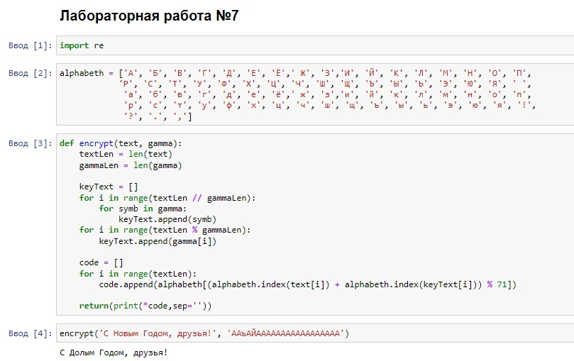
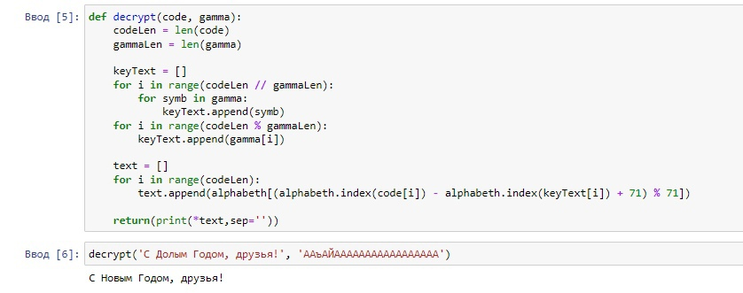
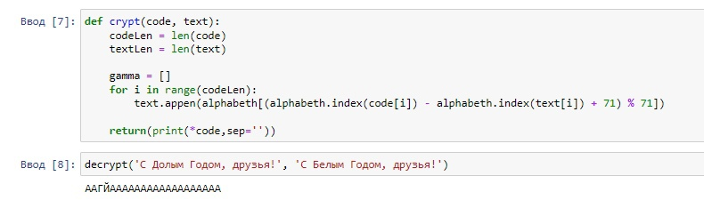

---
## Front matter
title: "Отчёт по лабораторной работе №7"
subtitle: "Дисциплина: Основы информационной безопасности"
author: "Набережных Дарина Денисовна, НПМбд-01-19"

## Generic otions
lang: ru-RU
toc-title: "Содержание"

## Bibliography
bibliography: bib/cite.bib
csl: pandoc/csl/gost-r-7-0-5-2008-numeric.csl

## Pdf output format
toc: true # Table of contents
toc-depth: 2
lof: true # List of figures
lot: true # List of tables
fontsize: 12pt
linestretch: 1.5
papersize: a4
documentclass: scrreprt
## I18n polyglossia
polyglossia-lang:
  name: russian
  options:
	- spelling=modern
	- babelshorthands=true
polyglossia-otherlangs:
  name: english
## I18n babel
babel-lang: russian
babel-otherlangs: english
## Fonts
mainfont: PT Serif
romanfont: PT Serif
sansfont: PT Sans
monofont: PT Mono
mainfontoptions: Ligatures=TeX
romanfontoptions: Ligatures=TeX
sansfontoptions: Ligatures=TeX,Scale=MatchLowercase
monofontoptions: Scale=MatchLowercase,Scale=0.9
## Biblatex
biblatex: true
biblio-style: "gost-numeric"
biblatexoptions:
  - parentracker=true
  - backend=biber
  - hyperref=auto
  - language=auto
  - autolang=other*
  - citestyle=gost-numeric
## Pandoc-crossref LaTeX customization
figureTitle: "Рис."
tableTitle: "Таблица"
listingTitle: "Листинг"
lofTitle: "Список иллюстраций"
lolTitle: "Листинги"
## Misc options
indent: true
header-includes:
  - \usepackage{indentfirst}
  - \usepackage{float} # keep figures where there are in the text
  - \floatplacement{figure}{H} # keep figures where there are in the text
---

# Цель работы

Освоить на практике применение режима однократного гаммирования

# Теоретическое введение

Гаммирование - наложение (снятие) на открытые (зашифрованные) данные последовательности элементов других данных, полученных с помощью некоторого криптографического алгоритма, для получения зашифрованных (открытых) данных.

# Выполнение лабораторной работы

Необходимо подобрать ключ, чтобы получить сообщение "С Новым Годом, друзья!". Сначала напишем функцию шифрования. Для этого зададим алфавит из заглавных, строчных букв русского алфавита и нескольких символов. (рис. [-@fig:001]).

{ #fig:001 width=70% }

Создадим  функцию расшифрования, которая работает аналогично. (рис. [-@fig:002]).

{ #fig:002 width=70% }

Теперь создадим фукнцию, определяющую ключ, с помощью которого шифротекст можно преобразовать в некоторый фрагмент текста, который представляет собой один из возможных вариантов прочтения открытого текста. (рис. [-@fig:003]).

{ #fig:003 width=70% }

 
# Выводы

Я освоила на практике применение режима однократного гаммирования.

# Список литературы{.unnumbered}

::: {#refs}
:::
